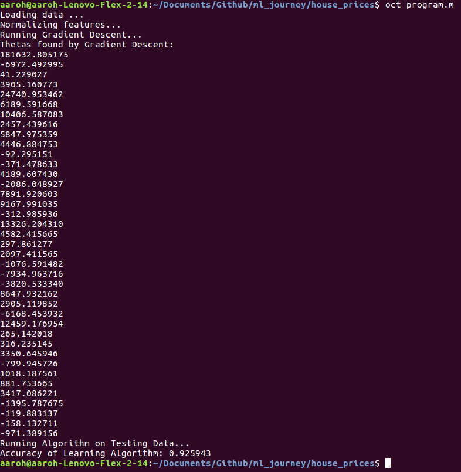

# House Prices: Linear Regression and Gradient Descent

I did this "Getting Started" Competition on Kaggle because I decided that
simply studying Machine Learning through a course would not give me adequate
experience in applying ML to practical projects.

Here's how I did this program:

I did this program after two weeks of
[Andrew Ng's Machine Learning Course](https://www.coursera.org/learn/machine-learning/)
on Coursera.

First off, I downloaded the dataset from
[Kaggle's website](https://www.kaggle.com/c/house-prices-advanced-regression-techniques#description).

As I started looking through the `train.csv` file, I saw that some of the
features were not numbers, but in fact words or letters, which I didn't know
how to quantify in my data. I decided to remove the complex qualified data, and
convert the simple characters to integers, (e.g. y/n => 1/0).

Unfortunately, I completed this process in Google Sheets, and did not keep
track of which columns I deleted and which columns I converted. Because of this
reason, I decided to remove the `test.csv` and split the training data into
90/10 percent chunks. (My data now had 39 features vs. the original 79.)

Now that I had my data imported and cleaned, I could move on to my actual
algorithm.

## Feature Normalization

My first step was to normalize my features. In Professor Ng's course, we learn
a basic form of normalization called Feature Standardization. Some favorable
properties of this algorithm are that it is relatively quick to perform once
vectorized, and translates to one line of code in Octave/Matlab. Normalizing my
data also allows me to converge my Cost Function quicker. Here is what
it looks like:

} )

This formula gave my features a mean of 0, and a unit variance.

## Gradient Descent

Before I could run Gradient Descent on my data, I had to add a column of 1s to
my data. (This is necessary to make the dimensions of my weights and features
match.)

Here is the vectorized implementation of the Gradient Descent Algorithm I used.
I set my learning rate to 0.1 and chose to iterate the Algorithm 1500 times.
(The learning rate and iterations were tweaked several times until I settled on
values that converged relatively quickly.)

 )

For every iteration, I computed the cost of my theta values through Mean Square
Error. The vectorized implementation I used looks like this:

^T(X\theta-y) )

## Running Algorithm on Test data

If you recall, I had segmented my data into 90/10 percent chunks during my data
cleaning step. Up to this point, I had computed my weights through the 90%
chunk. Now I will use the 10% chunk to test my algorithm.

Here were the steps that went into testing my program:

*   Normalize the testing data (My average and std. deviation were retured from
    the Feature Normalization step.)
*   Compute hypothesis values by matrix-matrix multiplication
    =X\theta )
*   Use Octave function `corr(hypothesis, test_data_y` to generate correlation
    between my hypothesis and expected values for houses.

My algorithm worked! I received an accuracy of 92.6%. Here is the output from
the program:

